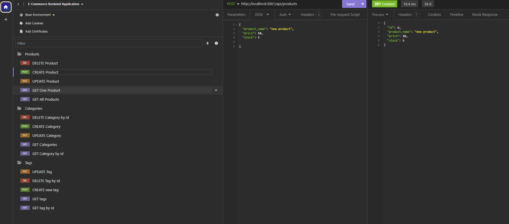

# E-Commerce Back End Challenge    
# [WATCH WALKTROUGH VIDEO HERE](https://youtu.be/jn6nlFLVbZ4?si=H8Gi5mdbpE_oYIlW)

## Table of Contents
- [Description](#description)
- [Installation](#installation)
- [Usage](#usage)
- [Contributors](#contributing)
- [Questions](#questions)

## Description
This app is about building the back end for an e-commerce site by taking  a working Express.js API and configure it to use Sequelize to interact with a MySQL database.

## Installation
To install the application, navigate to repository named 'e commerce back end challenge', install dependencies, run sql and the seeds. When everything is set up, open the url to insomnia.

## Usage
To use the application, click on the method routes displayed in insomnia to render desired results.

## Contributing
Contributors are welcome!

## Questions
  My GitHub profile is: Jenina52112 [View on GitHub](https://github.com/Jenina52112)

  For additional questions, contact me at email address: jeninadelacruz521@yahoo.com
